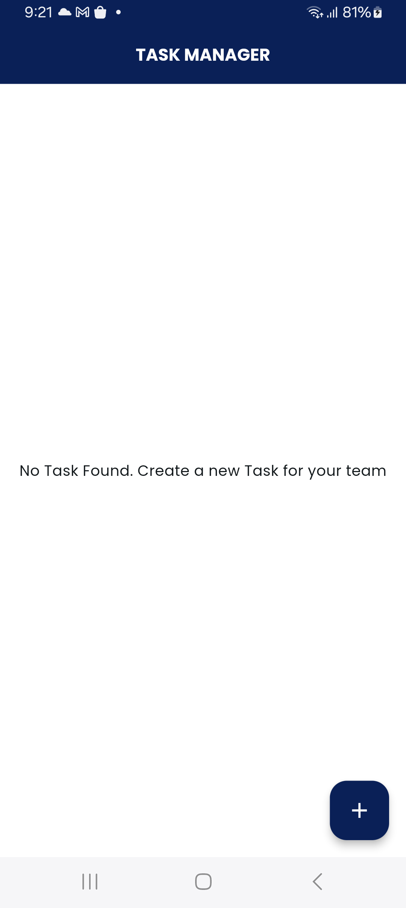
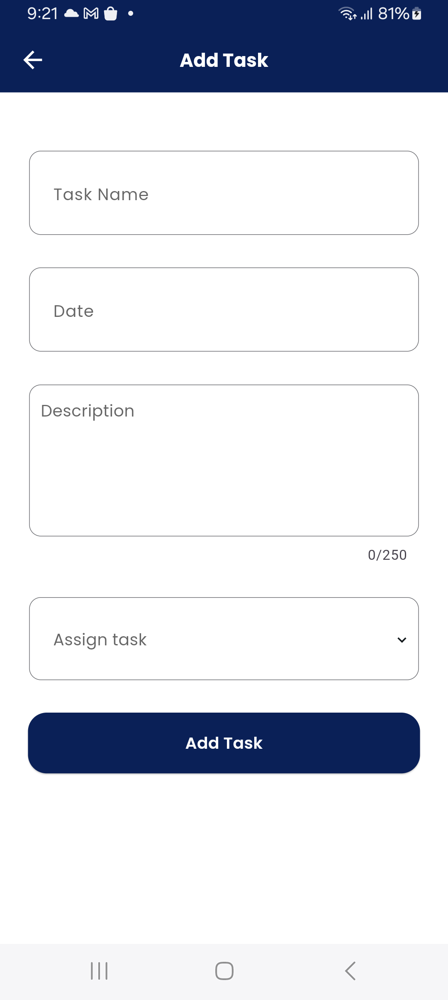
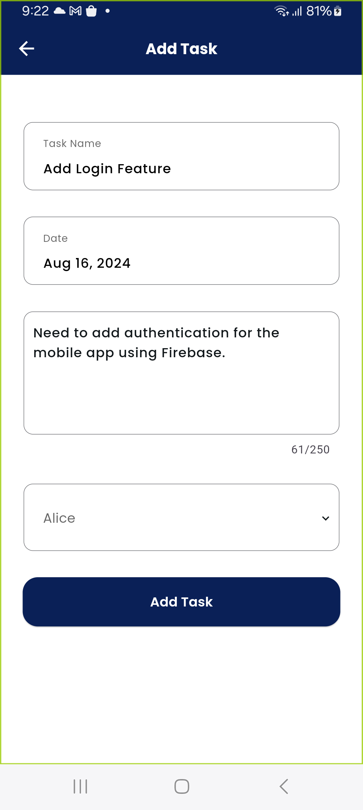
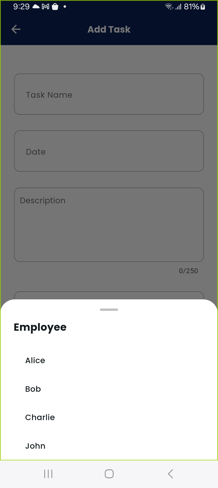
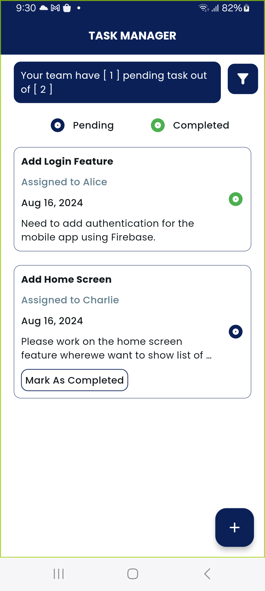
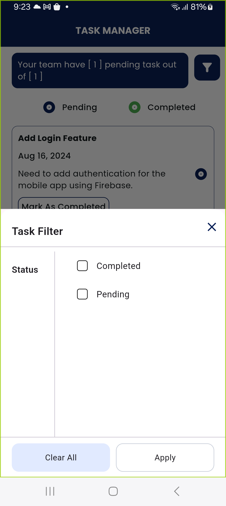
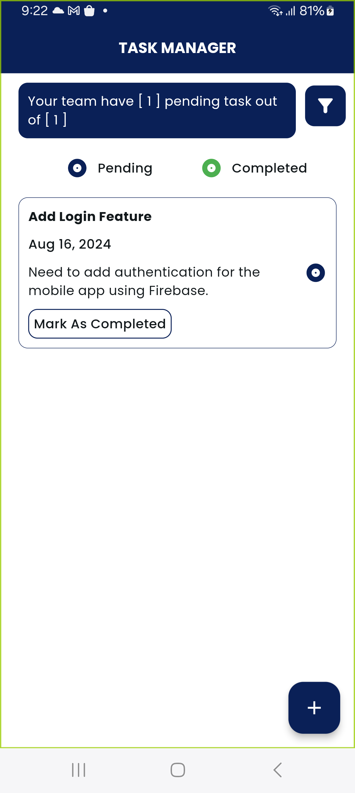
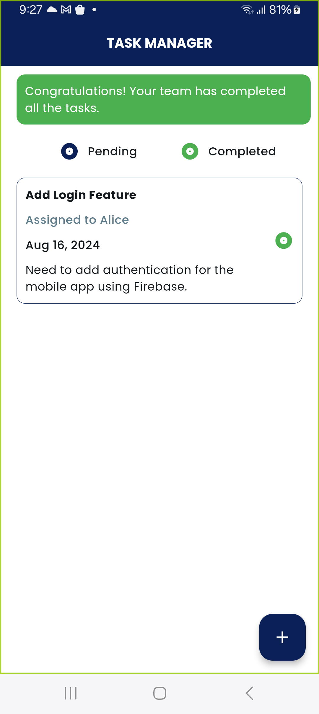

# task_manager

*****TASK MANAGER*****

*****App Functionality*****

This is the app for managing our tasks. The project manager can create tasks with task name, task description, date, and assign the task to any employee in their team.

The Home Screen will show list of all the tasks with the status of pending/completed. 

The user can use filter screen to filter the task with pending/completed.

All the task created will be saved in the local storage using shared preference and can be retrieved 

Attached the android build apk file in this repository.

*******Components Used*******

1. Bloc State Management
2. Clean Architecture
3. Shared Preference
4. Employee List JSON

*******Attached is the screenshots*******

    
    
    
    
    
    
    
    
    

